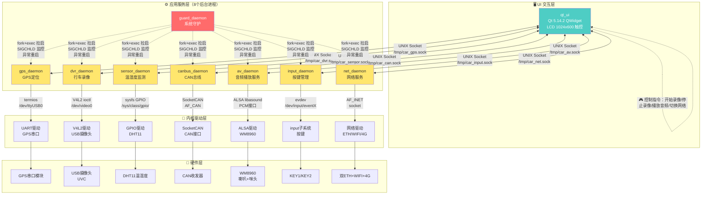
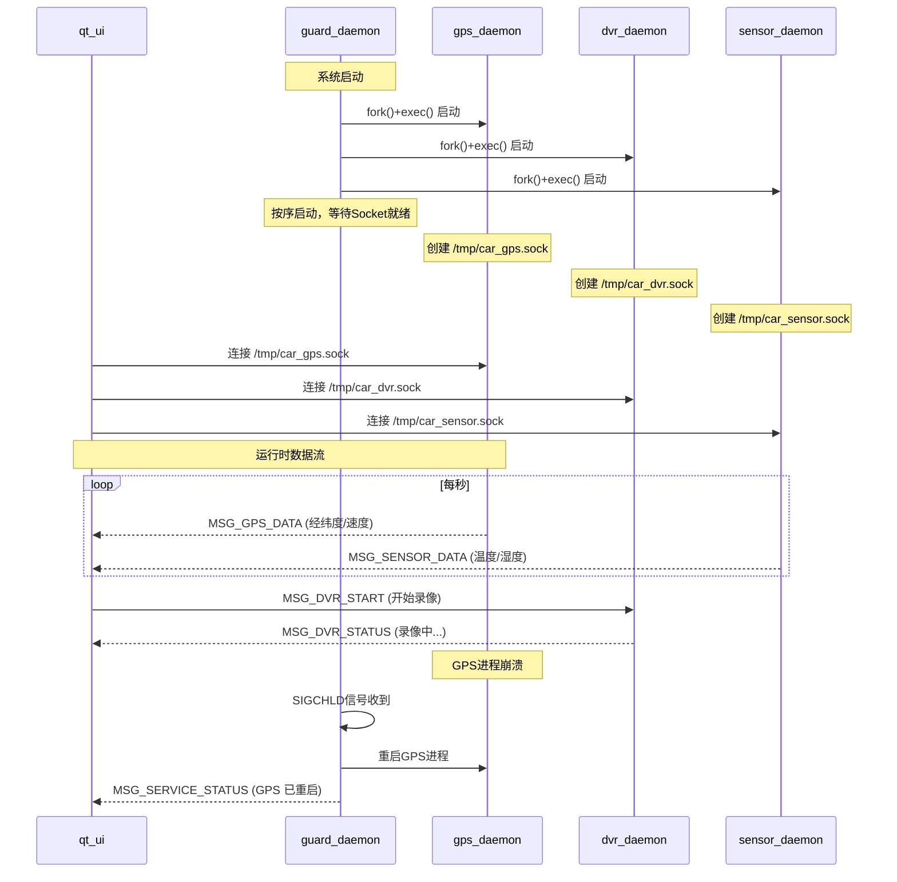
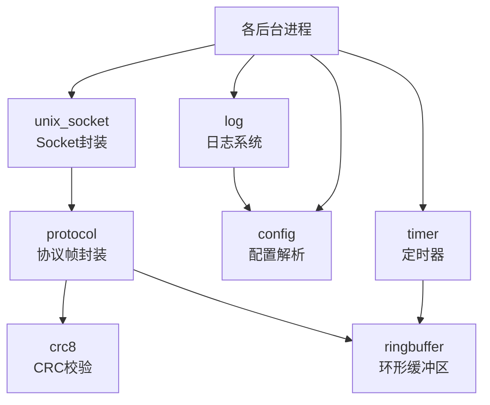

> **注意**: 本文档为**初始架构设计**。实际实现有所简化，请以源码为准:
> - **sensor_daemon 已由 Qt SensorThread 替代** (QThread 直读 `/dev/mydht11`)
> - **net_daemon 未实际部署** (云端通信功能尚未实现)
> - 实际运行 **5 个守护进程 + 1 个 Qt UI** (UI 内含 SensorThread)
> - 进程表仍保留 7 个定义，`sensor_daemon` 与 `net_daemon` 为 `enabled=0`
>   的预留槽位，由 `config.ini` 的 `[processes]` 节控制，详见下文"进程启停表"
> - **进程由 `guard_daemon` 统一托管**: 它 fork+exec 拉起全部子进程并监控，
>   崩溃自动重启 (60 秒窗口内最多 5 次)。启动脚本为 `scripts/start_all.sh`
> - 详细实现状态见 [调试问题记录.md](调试问题记录.md) 和 [学习文档.md](学习文档.md)

### 进程启停表 (当前实际状态)

`guard_daemon` 的进程表共 7 项，其中 5 项默认启用:

| 进程 | 默认 | 说明 |
|---|---|---|
| `gps_daemon` | 启用 | GPS 定位 |
| `sensor_daemon` | **预留** | 功能由 Qt SensorThread 承担 |
| `input_daemon` | 启用 | 按键输入 |
| `canbus_daemon` | 启用 | CAN 总线 |
| `av_daemon` | 启用 | 音频播放 |
| `dvr_daemon` | 启用 | 行车记录 |
| `net_daemon` | **预留** | 云端通信，未部署 |

可在 `config/config.ini` 的 `[processes]` 节中修改启停，无需改代码。

# 智能车载终端 - 架构设计文档

## Context

基于 i.MX6ULL 开发板（528MHz 单核 / 512MB DDR3 / 4GB eMMC）的智能车载终端项目，采用 **5个C语言后台进程 + 1个Qt线程** 的多进程架构。本设计文档覆盖整体架构、IPC协议、公共库划分、数据结构、开发顺序、知识图谱和性能优化策略。面向大三学生学习嵌入式Linux应用层开发。

---

## 一、整体架构设计

### 核心设计原则

| 原则 | 说明 | 原因 |
|------|------|------|
| **多进程而非多线程** | 每个功能模块独立进程 | 进程间天然隔离，一个模块崩溃不影响其他；方便独立开发调试；学生可逐模块学习 |
| **UNIX Domain Socket 统一通信** | 全部IPC通过本地Socket | 相比共享内存更安全；比管道/消息队列支持双向通信；Qt原生支持Socket；未来可平滑迁移到网络通信 |
| **事件驱动 + poll** | 所有IO非阻塞，单线程poll循环 | 实际部署中epoll/timerfd存在兼容问题，统一改用POSIX poll+signal；poll是更通用的标准接口 |
| **守护进程统一管理** | guard_daemon 负责拉起、监控、重启 | 嵌入式设备长期运行的核心保障，也是学习Linux守护进程的典型实践 |

### 1.1 整体架构图（四层模型）

> **当前实现说明**: 以下 Mermaid 图为原始设计架构。实际实现中，应用服务层简化为 5 个后台进程（guard_daemon、gps_daemon、dvr_daemon、canbus_daemon、av_daemon），sensor_daemon 的功能已由 Qt UI 层的 SensorThread (QThread 直读 /dev/mydht11) 替代，net_daemon 未实际部署运行，input_daemon 暂未运行。



### 1.2 进程间数据流详解



### 1.3 IPC通信模型

```
┌─────────────────────────────────────────────────────────────┐
│                    Qt UI (客户端角色)                        │
│  作为Client主动连接所有后台服务的Socket                       │
│  QLocalSocket × 5 个连接实例                                │
└────┬──────┬──────┬──────┬──────┬──────┬──────┬──────────────┘
     │      │      │      │      │      │      │
     ▼      ▼      ▼      ▼      ▼      ▼      ▼
┌────┴──────┴──────┴──────┴──────┴──────┴──────┴──────────────┐
│              后台服务进程 (服务端角色)                        │
│  每个进程创建各自的 UNIX Socket，监听客户端连接               │
│  使用 epoll 同时监听 Socket + 硬件设备 + 定时器               │
└─────────────────────────────────────────────────────────────┘

通信模式：
  请求-响应：UI发指令 → 后台处理 → 返回结果
  主动推送：后台定期推送数据(如GPS每秒推送位置)
  广播通知：guard_daemon通知UI某服务状态变化
```

---

## 二、进程间通信协议设计

### 2.1 为什么选择自定义二进制协议

| 对比项 | 自定义二进制协议 ✅ | JSON文本协议 | Protobuf |
|--------|---------------------|-------------|----------|
| 解析开销 | 极低(直接强转结构体) | 中等(需JSON解析库) | 需引入protobuf库 |
| 数据量 | 最小(无冗余字段名) | 较大(有key名) | 最小 |
| 依赖 | 无外部库 | 需cJSON/json-c | 需protobuf-c |
| 学习价值 | 理解字节序/对齐/序列化 | 理解文本解析 | 理解IDL和代码生成 |
| 适合场景 | 嵌入式小数据高频通信 | 对云通信 | 复杂嵌套结构 |

**选择二进制协议的原因：**
1. 528MHz单核CPU，解析100字节JSON可能用几百微秒，二进制协议直接强转零开销
2. 不引入第三方库依赖（符合项目约束）
3. 学习价值高——理解网络字节序、结构体内存对齐、序列化/反序列化

### 2.2 消息帧结构

```
 字节偏移   0        1        2        3       4..(4+len-1)    (4+len)  (5+len)
┌────────┬────────┬────────┬────────┬─────────────────────┬─────────┬─────────┐
│  HEAD0 │  HEAD1 │  TYPE  │  LEN   │       DATA          │  CRC8   │  TAIL   │
│  0xAA  │  0x55  │ 1 Byte │ 2 Bytes│   0~65535 Bytes     │ 1 Byte  │  0x55   │
└────────┴────────┴────────┴────────┴─────────────────────┴─────────┴─────────┘
  [帧头2字节] [消息类型] [数据长度] [   可变长数据   ] [校验] [帧尾1字节]

帧头 (HEAD):  0xAA 0x55  — 两个互补的魔数，组合后不易误识别
消息类型(TYPE): 1字节 — 最多支持256种消息类型
数据长度(LEN):  2字节 大端序(Big-Endian) — 最大65535字节
数据(DATA):     可变长  — 具体内容由TYPE决定
CRC8校验:       1字节  — 多项式 0x07，覆盖 TYPE+LEN+DATA
帧尾 (TAIL):   0x55    — 辅助帧同步校验
```

**设计原因：**
- **双字节帧头**：单字节0xAA误识别概率高，0xAA+0x55互补序列在随机数据中极少出现
- **大端序长度**：网络字节序标准，便于以后扩展网络通信
- **CRC8而非CRC16**：消息短（通常<256字节），CRC8足够；节省CPU
- **帧尾0x55**：与帧头第二个字节相同，可辅助二次校验和帧同步恢复

### 2.3 消息类型枚举定义

```
消息类型分类（1字节，高4位=模块ID，低4位=消息ID）

模块ID分配：
  0x00 — 系统通用消息（guard_daemon）
  0x10 — GPS 定位消息
  0x20 — DVR 录像消息
  0x30 — 传感器消息
  0x40 — 网络服务消息
  0x50 — CAN总线消息
  0x60 — 音视频消息
  0x70 — 按键输入消息

═══════════════════════════════════════════════════════════
  系统通用消息 (0x00 ~ 0x0F)
═══════════════════════════════════════════════════════════
  MSG_HEARTBEAT        = 0x00  // 心跳请求/响应
  MSG_SERVICE_STATUS   = 0x01  // 服务状态通知
  MSG_SERVICE_RESTART  = 0x02  // 请求重启某服务
  MSG_SYSTEM_SHUTDOWN  = 0x03  // 系统关机通知
  MSG_LOG_REQUEST      = 0x04  // 请求上传日志

═══════════════════════════════════════════════════════════
  GPS 定位消息 (0x10 ~ 0x1F)
═══════════════════════════════════════════════════════════
  MSG_GPS_DATA         = 0x10  // GPS数据推送（被动推送）
  MSG_GPS_QUERY        = 0x11  // 请求最新GPS数据
  MSG_GPS_CONFIG       = 0x12  // GPS配置（上报频率等）
  MSG_GPS_STATUS       = 0x13  // GPS状态（搜星数/信号质量）

═══════════════════════════════════════════════════════════
  DVR 录像消息 (0x20 ~ 0x2F)
═══════════════════════════════════════════════════════════
  MSG_DVR_START        = 0x20  // 开始录像
  MSG_DVR_STOP         = 0x21  // 停止录像
  MSG_DVR_STATUS       = 0x22  // 录像状态（时长/文件大小）
  MSG_DVR_SNAPSHOT     = 0x23  // 抓拍一帧
  MSG_DVR_FILE_LIST    = 0x24  // 请求录像文件列表
  MSG_DVR_STORAGE_INFO = 0x25  // 存储空间信息

═══════════════════════════════════════════════════════════
  传感器消息 (0x30 ~ 0x3F)
═══════════════════════════════════════════════════════════
  MSG_SENSOR_DATA      = 0x30  // 温湿度数据推送
  MSG_SENSOR_QUERY     = 0x31  // 请求最新数据
  MSG_SENSOR_CONFIG    = 0x32  // 传感器配置（采样间隔）
  MSG_SENSOR_ALERT     = 0x33  // 温湿度超阈值告警

═══════════════════════════════════════════════════════════
  网络服务消息 (0x40 ~ 0x4F)
═══════════════════════════════════════════════════════════
  MSG_NET_STATUS       = 0x40  // 网络状态（当前链路/信号强度）
  MSG_NET_SWITCH       = 0x41  // 切换网络（WIFI/4G/ETH）
  MSG_NET_UPLOAD       = 0x42  // 上传数据到云端
  MSG_NET_DOWNLOAD     = 0x43  // 下载数据/OTA升级

═══════════════════════════════════════════════════════════
  CAN总线消息 (0x50 ~ 0x5F)
═══════════════════════════════════════════════════════════
  MSG_CAN_DATA         = 0x50  // CAN报文推送
  MSG_CAN_SEND         = 0x51  // 发送CAN报文
  MSG_CAN_FILTER       = 0x52  // 设置CAN过滤规则
  MSG_CAN_STATUS       = 0x53  // CAN总线状态

═══════════════════════════════════════════════════════════
  音视频消息 (0x60 ~ 0x6F)
═══════════════════════════════════════════════════════════
  MSG_AV_PLAY          = 0x60  // 播放指定音频文件
  MSG_AV_STOP          = 0x61  // 停止播放
  MSG_AV_PAUSE         = 0x62  // 暂停/继续
  MSG_AV_VOLUME        = 0x63  // 设置音量
  MSG_AV_STATUS        = 0x64  // 播放状态
  // MSG_AV_RECORD_START (已废弃)  // 开始录音
  // MSG_AV_RECORD_STOP  (已废弃)  // 停止录音

═══════════════════════════════════════════════════════════
  按键输入消息 (0x70 ~ 0x7F)
═══════════════════════════════════════════════════════════
  MSG_KEY_EVENT        = 0x70  // 按键事件通知
  MSG_LED_CONTROL      = 0x71  // 控制用户LED
```

> **实现修正 (htons/ntohs 问题)**: 原始设计指定 LEN 字段使用大端序 (Big-Endian)，计划通过 `htons()`/`ntohs()` 进行字节序转换。实际实现中发现该方式存在兼容性问题，最终改为直接拆分字节编码，不再使用 `htons`/`ntohs`。详情见 `docs/调试问题记录.md`。

### 2.4 通用消息帧C语言内存布局

```
帧结构体在内存中的布局（C99 struct）：
─────────────────────────────────────────
| uint8_t  head[2]     |  2 bytes      |
| uint8_t  type        |  1 byte       |
| uint16_t length      |  2 bytes 大端  |
| uint8_t  data[N]     |  N bytes      |
| uint8_t  crc8        |  1 byte       |
| uint8_t  tail        |  1 byte       |
─────────────────────────────────────────
总开销: 7 字节（帧头2+类型1+长度2+CRC1+帧尾1）
最大消息: 7 + 65535 = 65542 字节
实际使用: 通常 < 256 字节（GPS数据约40字节，传感器约10字节）
```

---

## 三、公共库模块划分

### 3.1 模块总览

```
src/common/
├── common.h           // 全局头文件（类型定义/返回码/版本号）
├── log/
│   ├── log.h          // 日志接口声明
│   └── log.c          // 日志实现（分级/轮转/写文件）
├── socket/
│   ├── unix_socket.h  // UNIX Socket封装接口
│   └── unix_socket.c  // Socket创建/绑定/监听/连接/收发
├── protocol/
│   ├── protocol.h     // 协议帧封装/解析/校验
│   └── protocol.c     // 组帧/拆帧/CRC8计算/转义
├── ringbuffer/
│   ├── ringbuffer.h   // 环形缓冲区接口
│   └── ringbuffer.c   // 无锁环形缓冲区实现
├── crc/
│   ├── crc8.h         // CRC8校验接口
│   └── crc8.c         // CRC8查表法实现
├── config/
│   ├── config.h       // 配置文件解析接口
│   └── config.c       // INI格式配置文件解析
└── timer/
    ├── timer.h        // 定时器接口
    └── timer.c        // 基于epoll的软件定时器
```

### 3.2 各模块设计说明

| 模块 | 功能 | 核心API | 对应Linux知识点 |
|------|------|---------|-----------------|
| **log** | 分级日志/文件轮转 | `log_init()`, `log_write(level, fmt, ...)`, `log_rotate()` | 文件IO、`syslog`、变参`va_list` |
| **unix_socket** | Socket封装 | `sock_create_server()`, `sock_accept()`, `sock_send()`, `sock_recv()` | UNIX Domain Socket、`bind/listen/accept`、非阻塞IO |
| **protocol** | 消息组帧/拆帧 | `proto_pack()`, `proto_unpack()`, `proto_check_crc()` | 字节序转换、结构体对齐、状态机 |
| **ringbuffer** | 环形缓冲区 | `rb_init()`, `rb_write()`, `rb_read()`, `rb_available()` | 内存管理、无锁数据结构 |
| **crc8** | CRC校验 | `crc8_calculate(data, len)` | 查表法/位运算 |
| **config** | 配置文件解析 | `config_load()`, `config_get_str()`, `config_get_int()` | 字符串处理、文件IO |
| **timer** | 软件定时器 | `timer_add()`, `timer_del()`, `timer_tick()` | `timerfd_create()` 或 epoll超时 |

### 3.3 公共库依赖关系



---

## 四、开发顺序建议

> **实际实现说明**: 实际开发中对架构做了简化。sensor_daemon 被移除，温湿度监测改为 Qt UI 内的 SensorThread (QThread 直读 /dev/mydht11)；net_daemon 未实际运行；input_daemon 暂未部署。实际运行进程为 5 个后台守护进程 + 1 个 Qt UI (含 SensorThread)。以下为原始开发计划，仅供参考。

按照 **依赖关系 → 学习曲线 → 可测试性** 三个维度排序，分6个阶段：

### 阶段一：基础设施（第1-2周）
**模块：common库（log → crc8 → ringbuffer → config → socket → protocol → timer）**

| 顺序 | 模块 | 理由 |
|------|------|------|
| 1 | log | 最先做——所有模块都需要日志输出，开发调试的基础 |
| 2 | crc8 | 纯算法，无外部依赖，写完就能单元测试 |
| 3 | ringbuffer | 数据结构基础，socket接收需要缓冲，依赖关系简单 |
| 4 | config | 配置文件解析，需要文件IO —— 放到有一定基础后 |
| 5 | unix_socket | 封装Socket API，依赖protocol —— 最核心的IPC基础 |
| 6 | protocol | 组帧/拆帧，依赖crc8 + ringbuffer |
| 7 | timer | 软件定时器，为后续定时任务做准备 |

### 阶段二：系统骨架（第3周）
**模块：guard_daemon** — 它是所有进程的"父亲"，有了它才能统一管理其他进程。

### 阶段三：硬件数据采集层（第4-6周）
**按难度递增：sensor_daemon → gps_daemon → input_daemon**

### 阶段四：复杂I/O层（第7-8周）
**按难度递增：canbus_daemon → av_daemon**

### 阶段五：高级应用层（第9-10周）
**模块：dvr_daemon → net_daemon**

### 阶段六：UI集成（第11-12周）
**模块：qt_ui** — 需要所有后台进程就绪才能联调。

```
时间线总览：
Week  1-2:  ████████  common库 (8个子模块)
Week  3:    ████      guard_daemon
Week  4-6:  ████████████  sensor → gps → input
Week  7-8:  ████████  canbus → av
Week  9-10: ████████  dvr → net
Week  11-12:████████  qt_ui 集成联调
```

---

## 五、配置文件设计

> **实际实现说明**: dvr_daemon 实际使用 `/record/` 路径作为录像存储目录，而非配置文件中设计的 `/mnt/sdcard/dvr/`。

将分散的硬编码配置集中到 `/etc/car_terminal/config.ini`：

```ini
[system]
log_level = 1              ; 0=DEBUG 1=INFO 2=WARN 3=ERROR
log_path = /var/log/car_terminal/
log_max_size = 10          ; MB
log_rotate_count = 5

[guard]
heartbeat_interval = 5     ; 秒
max_restart_count = 5      ; 短时间内最大重启次数
restart_window = 60        ; 重启计数窗口 秒

[gps]
uart_device = /dev/ttyUSB0
baud_rate = 9600
report_interval = 1        ; 数据上报间隔 秒

[dvr]
video_device = /dev/video0
storage_path = /mnt/sdcard/dvr/
storage_limit = 2000       ; MB 录像存储上限
frame_rate = 15            ; fps
resolution_width = 640
resolution_height = 480

[sensor]
gpio_number = 3            ; GPIO1_IO03
sample_interval = 2        ; 采样间隔 秒
temp_high = 50.0           ; 高温告警℃
temp_low = -10.0           ; 低温告警℃

[canbus]
interface = can0
bitrate = 500000

[audio]
pcm_device = hw:0,0
default_volume = 70

[network]
cloud_server = api.carcloud.com
cloud_port = 8080
upload_interval = 30       ; 秒

[input]
long_press_ms = 2000
double_click_ms = 500
```
